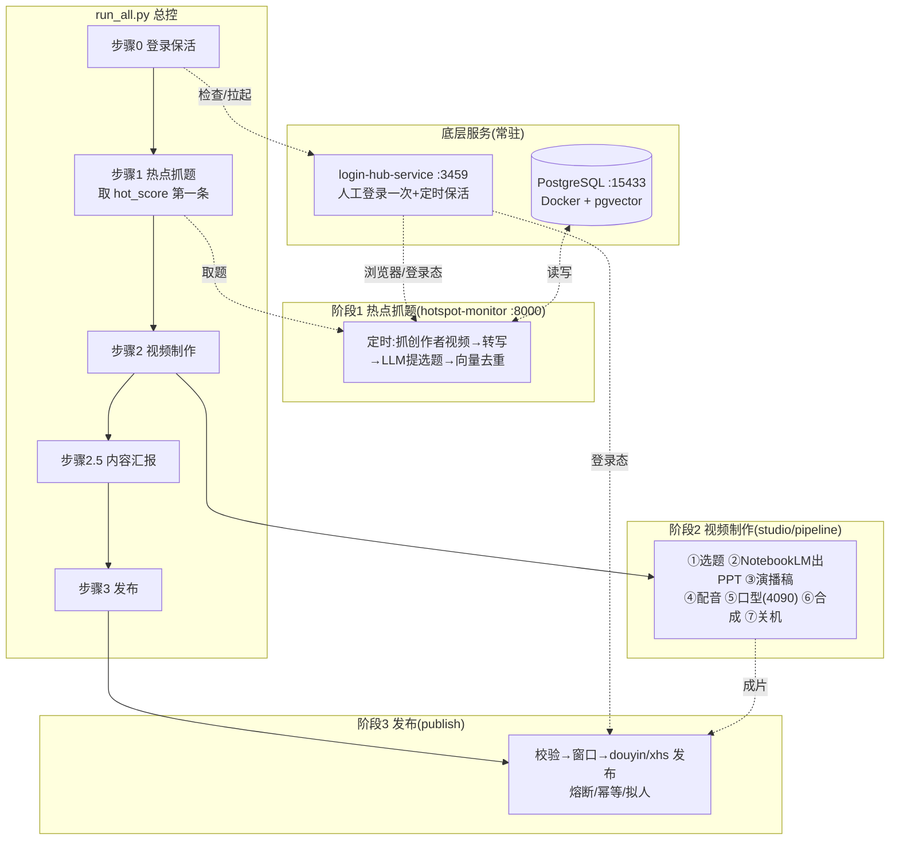
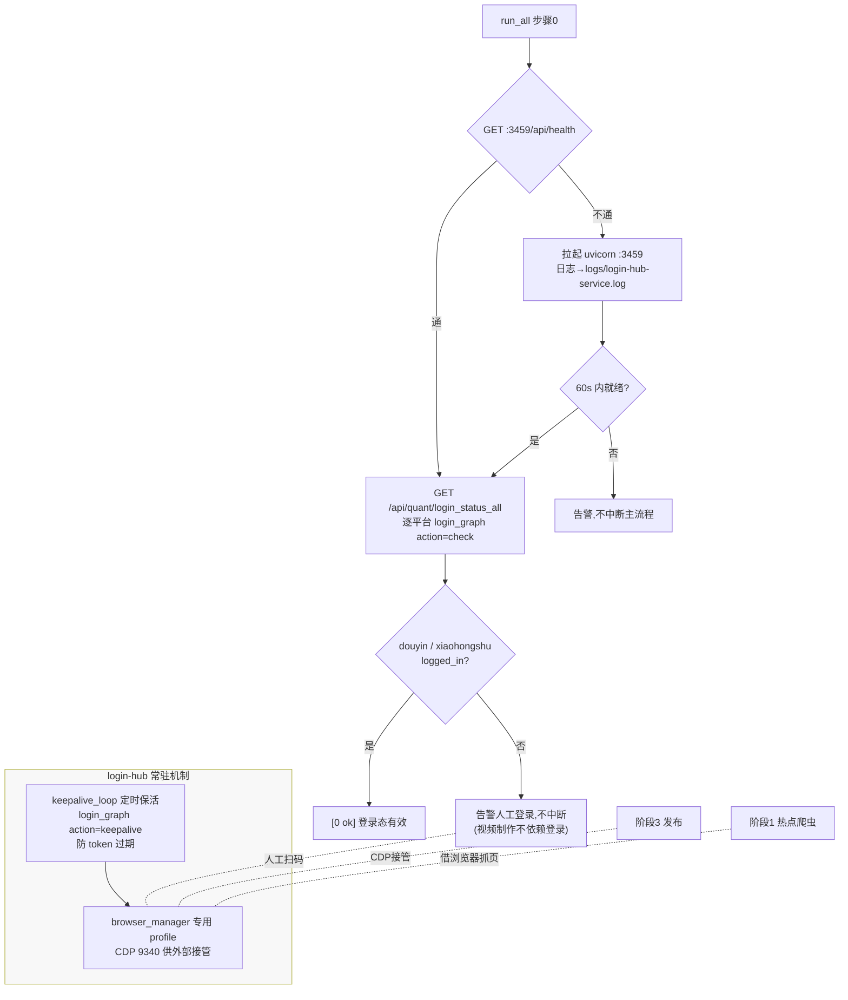
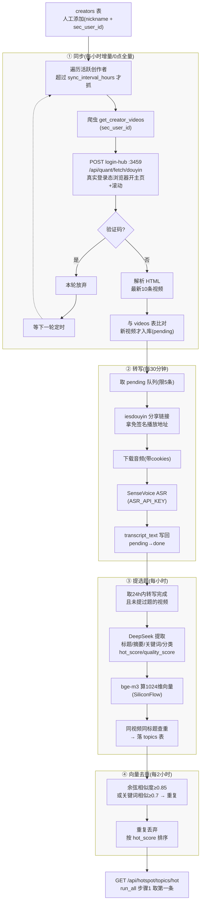
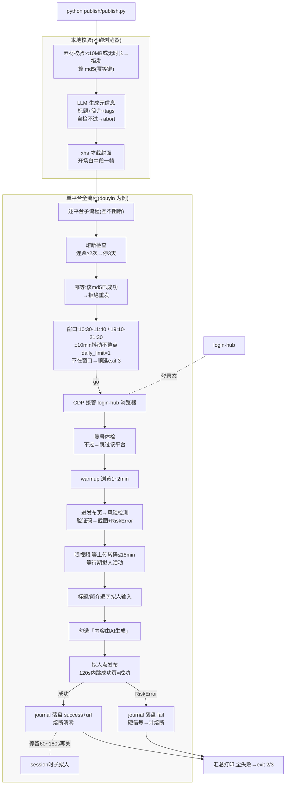

# 全链路总控与流程图(2026-10-09 建)

> 【现行文档】描述 `run_all.py` 总控及各阶段完整流程。
> 子模块设计详见:`studio/README.md`(视频制作)、`publish/README.md`(发布)、
> `hotspot-monitor-service/README.md`(热点服务)、`login-hub-service/README.md`(登录中心)。

---

## 一、总控用法

```bash
python run_all.py              # 全链路一条跑完
python run_all.py --no-topic   # 跳过热点抓题,内容环节自主选题
python run_all.py --no-publish # 只到视频制作为止,不发布
python run_all.py --new-topic  # 强制换题:删旧选题/大纲/稿/PPT/笔记本链接,全部重来
```

退出码:`0`=成功;`2`=环节失败;`3`=发布窗口未到(视频已就绪,顺延,**不是故障**)。

> **断点续跑规则**:`assets/voices.txt` 还在 → ①②③(选题/NotebookLM/演播稿)整段跳过,
> 从 ④配音 接着跑,不浪费 NotebookLM 额度。想重新选题必须加 `--new-topic`。

---

## 二、总图(全链路一张)



四张分阶段详图见下文 §三~§六。

---

## 三、阶段0:登录保活(run_all 步骤0)



要点:登录态维护在 login-hub 后台保活循环,阶段0 只做检查+拉起;
平台名映射:config.json 的 `xhs` → hub 注册键 `xiaohongshu`(run_all 内 `HUB_PLATFORM_KEY`)。

---

## 四、阶段1:热点抓题(hotspot-monitor 内部)

> 代码:调度 `scheduler.py` / 爬虫 `crawlers/douyin_crawler.py` /
> 业务 `services/` / 去重 `dedup/vector_dedup.py`



三个核心设计:
- **不对抗风控**:抓页全部借 login-hub 真实登录态浏览器,取播放地址走 iesdouyin 免签名分享链接;
- **三级闸门防脏数据**:验证码检测 → video_id 查重 → 标题查重+向量去重;
- **异步滚动**:四个任务各按间隔跑,靠 DB 状态字段(`transcript_status`/`extracted_at`)接力,互不阻塞。

---

## 五、阶段2:视频制作(studio/pipeline 七步)

```mermaid
flowchart TD
    START["pipeline 默认链<br/>content→voice→lip→compose→shutdown"] --> A

    subgraph P13["①③ content.py 选题+演播稿"]
        A{"voices.txt 在?"} -- "在" --> SKIP["断点续跑:①②③跳过"]
        A -- "不在" --> A1{"topic.json+outline.json 在?"}
        A1 -- "在" --> A2["[选题复用]"]
        A1 -- "不在" --> A3["LLM 出题:方向池轮换<br/>查重缓存避旧题<br/>TOPIC_HINT 非空则围绕热点"]
        A3 --> A4["结构规划LLM:10~16页<br/>钩子先行/叙事弧线<br/>→ outline.json/topic.json"]
        A4 --> A5["换题清理 _invalidate_stale<br/>旧稿/音频/口型/页图全作废"]
        A2 --> A6["nb_prompt.txt(方案B)<br/>质量纪律+叙事弧线,不锁骨架"]
        A5 --> A6
    end

    A6 --> NB

    subgraph P2["② NotebookLM(nb_auto.py)"]
        NB["Chrome CDP 9333<br/>专用 profile(Google已登录)"] --> NB1["「发现来源」联网检索<br/>(0来源提交会被静默丢弃)"] --> NB2["填入提示词<br/>submit=false 只填不提交"] --> NB3{"额度尽?"}
        NB3 -- "是" --> NB4["「稍后生成」排队<br/>exit 3,重跑自动补收"]
        NB3 -- "否" --> NB5["等卡片(≤7200s)<br/>导出 PDF → slides.pdf"]
    end

    NB4 -.几小时后重跑.- A6
    NB5 --> C1["③ 演播稿:图片型PDF→视觉LLM逐页OCR<br/>→ LLM整篇通写(全局叙事/页间衔接)<br/>→ 禁词质检命中页重写<br/>→ 主编审≥70分定稿 → voices.txt"]

    C1 --> D{"voice?"}

    subgraph P4["④ 配音"]
        D -- "预置(alex等)" --> D1["本地 TTS(CosyVoice2)<br/>逐页 voice_pXX.wav<br/>稿件md5戳防旧音混用"]
        D -- "clone" --> D2["wait_gpu:连不上4090<br/>提示AutoDL开机+回车确认"] --> D3["输入指纹同步:稿/参考音/<br/>转写/形象 md5 变→清全部旧产物"] --> D4["上传参考素材<br/>4090 CosyVoice 克隆<br/>v2_pXX.wav 拉回本地"]
    end

    D1 --> E
    D4 --> E

    subgraph P5["⑤b 开场白口型(4090, intro版式)"]
        E["LLM 3候选开场白自评选优<br/>→ opening.wav(≤12s)"] --> E1["音频md5比对服务器<br/>变了→旧口型作废重推理"] --> E2["服务器脚本按md5同步"] --> E3["EMV3 推理(nohup+轮询)<br/>进程死/日志Error/超时→fail<br/>失联→等恢复30min"] --> E4["opening.mp4 拉回"] --> E5["avatar_scale=0.83 缩放<br/>宽超画布居中裁边<br/>白底补到1080x1920"]
    end

    E5 --> G["⑥ compose:1080x1920竖屏<br/>PPT区+白键抠像人像<br/>逐页字幕+页间0.4s<br/>→ final_video.mp4"] --> H["⑦ 关机4090<br/>ssh shutdown×3<br/>60s验证失联"]
    H --> H2{"关门狗(pipeline入口兜底):<br/>跑完GPU步骤但未显式<br/>安排shutdown?"}
    H2 -- "是" --> H3["自动补关机,不留空转实例"]
    H2 -- "否(只跑了content/voice)" --> H4["hint:GPU后续还要用<br/>记得手动 shutdown"]

    LLM(["LLM API"]) -.选题/大纲/稿/开场白.-> A3
    TTS(["TTS API"]) -.-> D1
    GPU(["4090 AutoDL"]) -.-> D2
    GPU -.-> E3
    NBM(["NotebookLM"]) -.-> NB

    style P13 fill:#f8f8f8
    style P2 fill:#f8f8f8
    style P4 fill:#f8f8f8
    style P5 fill:#f8f8f8
```



要点:每步产物都带**指纹校验**(换题/换稿/换参考音自动作废旧产物,绝不新旧混用);
GPU 只在 ④clone/⑤ 需要,⑦ 用完即关。

---

## 六、阶段3:发布(publish 九步链)



要点:**三层防风控** = 节流(窗口/限额)+ 行为(拟人输入/暖场/停留)+ 兜底(熔断/幂等);
所有异常一律 RiskError 停机带截图,绝不自动重试 —— 宁可少发不烧号。

---

## 七、人工维护入口(三条根)

| 入口 | 频率 | 作用 |
|---|---|---|
| `creators` 表加对标创作者(`POST /api/hotspot/creators`,需 sec_user_id) | 一次性+偶发 | 热点树的根,不加则热点链路空转 |
| login-hub 首次扫码登录(抖音/小红书) | 登录态失效时 | 爬虫与发布都靠它 |
| NotebookLM profile 首次登录 Google | 一次性 | ② 出 PPT 的前提 |

## 八、数据库配置

| 层 | 位置 | 说明 |
|---|---|---|
| 账密(源) | `docker/.env` 的 `POSTGRES_*` 四键 | Docker `cloneai_postgres`,端口 15433,含 pgvector |
| 连接串 | 环境变量 `DATABASE_URL` | config.py 不自读 .env;run_all 拉起时自动用 POSTGRES_* 拼;手动起服务须自带 |
| 表结构 | `hotspot-monitor-service/models/database.py` | 5 张表;建表 `python -c "from models.database import init_db; init_db()"`(2026-10-09 已建) |

## 九、2026-10-09 联调修复实录

| 问题 | 修复 |
|---|---|
| 缺依赖(sqlalchemy/psycopg 等) | pip 安装核心包 + `psycopg[binary]` |
| pydantic v2 不兼容(`APIResponse` 不能泛型化) | `models/schemas.py` 改 `BaseModel, Generic[T]` |
| `static/` 目录缺失启动报错 | 已创建 |
| `scheduler.is_running` 属性不存在 | `main.py` 改 `scheduler.scheduler.running` |
| 路由双重前缀;`/topics/hot` 被 `{topic_id}` 抢匹配 | 去掉内层 `/api/v1` 前缀;hot/quality 挪到 `{topic_id}` 之前 |
| ORM 对象无法被 pydantic v2 序列化(500) | `APIResponse.data`/`PaginatedResponse.items` 加 `field_validator` 统一 ORM→dict |
| topics 接口连不上库挂起 | run_all 拉起时自动拼 `DATABASE_URL` 注入;`init_db()` 建表 |
| run_all 查 xhs 登录态「未知」 | hub 注册键 `xiaohongshu`,run_all 加 `HUB_PLATFORM_KEY` 映射 |
| `--new-topic` 只删稿被「[选题复用]」接住 | 补删 `topic.json`/`outline.json`/`nb_notebook_url.txt` 五文件全清 |
