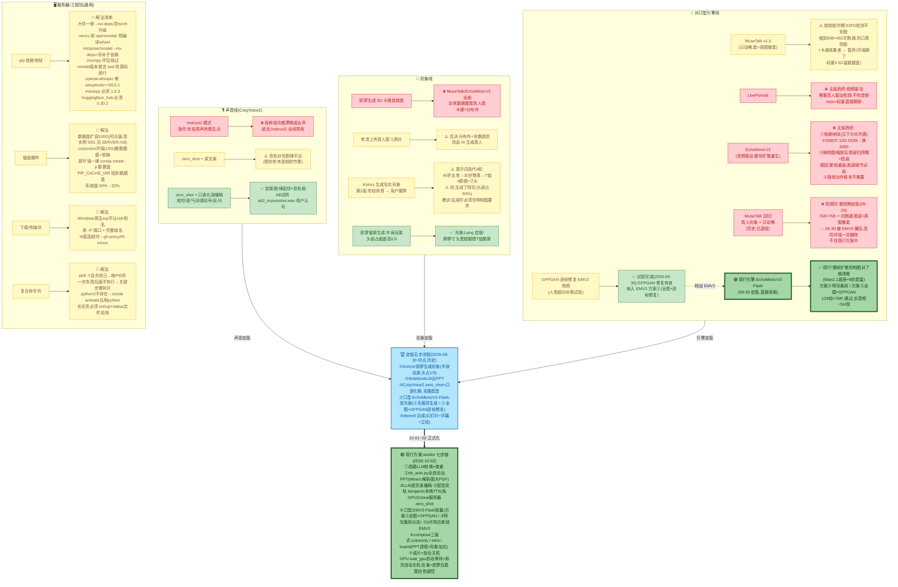

# 对口型/声音方案演进全景图

> 2026-09-27 ~ 10-02 全过程。绿色=定版成功，红色=无疾而终，黄色=踩坑后绕过。
> 【2026-10-02 标识】本文是**演进史记录**(历史)。**现行方案以 `studio/README.md` 为唯一设计来源**,本文 FINAL 节点为 09-30 时点,最新状态见文末"第六轮"。

## 无疾而终清单(一句话墓志铭)

| 方案 | 死因 |
|---|---|
| CosyVoice2 instruct2 | 指令怎么写都变女声，不可控 |
| LivePortrait | 视频驱动不吃音频，方向就不对 |
| EchoMimicV2 | 整帧扩散重生，脸部必糊必扭；装依赖花掉两天 (第五轮修正:另有 1.3B 基座太弱因素) |
| 3D 卡通娃娃形象 | 两个口型引擎都不支持，分布外 |
| 上传真人婴儿照片 | 分布外 + 效果不可预期，主动否决 |
| Kolors 本地生成形象 | 构图总是特写，被即梦半身远景替代 |
| MuseTalk | 真人版可用但被 EMV3 碾压，主动退役 |
| demo/ 试验目录 | 10-01~02 废弃，正式流程固化到 studio/ |
| 图生视频分镜(原方案六) | 含图生视频约 ¥6~12/分钟，成本否决 |

## 核心教训

1. **选引擎先看"改哪块像素"**:只动嘴(MuseTalk)画质有保障；整帧重画(EchoMimicV2)脸部必崩
2. **形象图的构图要求必须和人物长相一起写**，否则白跑 40 分钟推理
3. **卡在依赖上时立刻换思路**，别跟 pip 较劲(--no-deps + 预编译 wheel 是万能钥匙)
4. **长任务一律 nohup + status 文件**，SSH 断了不丢进度

## 第五轮更新(2026-09-30 晚):EchoMimicV3-Flash 定版

- **EchoMimicV3-Flash 定版(2026-09-30 用户拍板)**——"整帧扩散必糊"的魔咒被打破:糊的根源不是引擎,是**输入构图**(脸占画面比例)。裁剪到脸占 2/3 后,眼镜/牙齿/眉毛全清晰,口型自然
- 同族对比结论修正:EchoMimicV2 失败 = 引擎能力(1.3B 基座太弱)+ 构图双重问题;EMV3(Wan2.1 底座 + 8步蒸馏)能力够,构图对了就行
- **双方案定版**:②全图直喂+GFPGAN 逐帧修复(0.5s/帧,事后化妆)/ ③先裁剪再生成(质量上限更高)
- 显存红线:129帧×768×768 通过,200帧×768×1024 OOM → 长音频 ~5s/段分段
- 墓志铭更新:MuseTalk(真人版其实能用,但被 EMV3 全面碾压,主动退役)、EchoMimicV2(死于基座太弱)
- 服务器大扫除:MuseTalk/EchoMimicV2 全套删除,只留 CosyVoice + EchoMimicV3(定版引擎);数据盘剩 40G、系统盘剩 20G
- 详见《GPU服务器执行命令记录.md》15.4~15.8

## 第六轮更新(2026-10-01 ~ 10-02):demo → studio 正式化

- **流程固化到 `studio/`**:①选题LLM → ②NotebookLM出PPT(nb_auto.py 全自动) → ③动态演播稿 → ④配音 → ⑤口型 → ⑤b开场白 → ⑥合成 → ⑦交付关机;设计来源 = `studio/README.md`,服务器运维 = `studio/SERVER.md`
- **实例迁移**:旧 nmb2 弃用 → 新 4090 实例 nmb1(connect.nmb1.seetacloud.com:23278),全流程跑通成片
- **配音双轨**:`voice=alex/benjamin/charles/david` 等预置音色…免 GPU 一等路径(当前 config 为 alex);`voice=clone` 走服务器 zero_shot 克隆(脚本数据驱动化:clone_pages.py 读 voices.txt,本地 server_scripts/ 为唯一真源自动比对上传)
- **②能力升级**:骨架提示词真实键盘注入(原生 setter 被 Angular 丢弃)、稍后生成排队+补收、0来源自检、图片型 PDF 用 MinerU API 整体解析(备用:视觉LLM→本地OCR)
- **⑥board 版式新增**:PPT 左置绕竖轴向内透视(PERSPECTIVE 变换),形象满高站右;config.json 支持 `//` 注释
- **GPU 生命周期自动化**:wait_gpu 快连→等用户回车确认开机→轮询;跑完最后一个 GPU 步骤自动关机
- **乌龙记录**:CosyVoice 代码被前次会话清理误删(10-02 发现),已自愈脚本 setup_cosyvoice.sh 固化补拉;详见 studio/SERVER.md

## 现行方案全貌(2026-10-02 定版,以此为准)

> 与"第五轮定版五步"的差异:①选题/③演播稿改为 LLM 动态生成(不再人工);形象即梦白底图(Kolors 弃);口型 EMV3-Flash 单引擎(MuseTalk 退役);合成升级三版式;全程无人工环节,GPU 自动等待/自动关机。

**七步链**(代码在 `studio/`,总控 `python studio/pipeline.py`,分步 `content|voice|lipsync|opening|compose|shutdown`):

| 步 | 内容 | 实现 | GPU |
|---|---|---|---|
| ① | 选题+结构规划 | LLM 按 `content.directions` 轮换命题+查重,产出逐页骨架(标题/要点/钩子) | 无 |
| ② | NotebookLM 出 PPT | `nb_auto.py` 全自动:新建笔记本→来源粘贴→骨架提示词真实键盘注入→生成→下载 PDF;额度尽可"稍后生成"排队,重跑自动补收;图片型 PDF 用 MinerU API 整体解析 | 无 |
| ③ | 动态演播稿 | LLM 按 PPT 每页扩写口播词(140~220字/页),空行分页存 `assets/voices.txt` | 无 |
| ④ | 配音 | 双轨:`voice=benjamin` 本地 SiliconFlow CosyVoice2(免GPU,默认可用)/ `voice=clone` 服务器 zero_shot 克隆(参考音 voice_ref.wav + ref_prompt.txt) | clone 时需要 |
| ⑤ | 口型 | 服务器 EMV3-Flash 批量(run_jobs.py):seed43/8步蒸馏/TeaCache/≤5s切段/≤129帧,断点续跑;方案②全图+GFPGAN / ③特写裁剪 按场景分流 | 需要 |
| ⑤b | 开场白口型 | 单段 EMV3(≤129帧),仅 layout=intro/board 用 | 需要 |
| ⑥ | 合成 | `compose.py` 三版式:voiceonly(PPT全屏)/intro(真人开场+PPT正片)/board(PPT左置透视+形象满高站右全程口播);字幕按字数比例铺 | 无 |
| ⑦ | 交付关机 | 成片落 `output/final/`;跑完最后 GPU 步骤自动关机 | — |

**GPU 生命周期**:`wait_gpu()` 快连(10s 超时)→连不上打印"请到控制台开机"等用户回车确认→轮询就绪立即开干;端口变了只改 `config.json → server.port`。

**配置**:全部可变参数在 `studio/config.json`(支持 `//` 注释);服务器资产/坑见 `studio/SERVER.md`。
